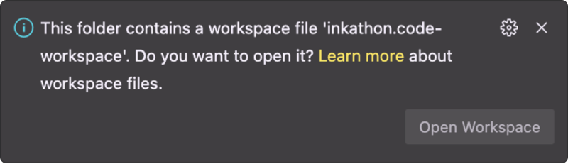

**Table of Contents:**

1. [About 📖](#about-)
2. [Getting started 🚀](#getting-started-)
   1. [1. Run the frontend](#1-run-the-frontend)
   2. [2. Build \& deploy contracts on a local node](#2-build--deploy-contracts-on-a-local-node)
   3. [3. Connect the frontend to the local node](#3-connect-the-frontend-to-the-local-node)
3. [Customization 🎨](#customization-)
   1. [1. Project Name](#1-project-name)
   2. [2. Custom Contracts](#2-custom-contracts)
   3. [3. Custom Scripts](#3-custom-scripts)
4. [The Stack 🥞](#the-stack-)
5. [Live Examples 🌐](#live-examples-)
6. [Deployment 🚢](#deployment-)
   1. [Environment Variables](#environment-variables)
   2. [Contract Deployment](#contract-deployment)
7. [VSCode Setup 🛠](#vscode-setup-)
   1. [Workspace](#workspace)
   2. [Plugins](#plugins)
8. [FAQs \& Troubleshooting 💬](#faqs--troubleshooting-)

---

## About 📖

The boilerplate comes with a small sample ink! `Greeter` contract which stores a `message` (the "greeting") and allows anyone to update it. The frontend contains simple UI components to connect your wallet and interact with the contract (i.e. read & write the `message`). Try it out live on [inkathon.xyz](https://inkathon.xyz).

The contracts directory contains the following folders:
- `src/` – Contains the `Greeter` contract
        - Contains the `Chronicle` contract
        - Contains the `Insurance` contract

- `deployments/` – Contains the deployment artifacts for the `Greeter`, `Chronicle`, `Insurance`, contracts
- `scripts/` – Contains scripts to build, test, and deploy the contracts


## Getting started 🚀

### 1. Run the frontend

The frontend works out of the box, without a local node running, as the sample contract is pre-deployed on certain live testnets (i.e. `alephzero-testnet` and `shibuya`). Necessary deployment metadata and addresses are provided under `contracts/deployments/`.

> **Pre-requisites:**
>
> - Setup Node.js v18+ (recommended via [nvm](https://github.com/nvm-sh/nvm) with `nvm install 18`)
> - Install [pnpm](https://pnpm.io/installation) (recommended via [Node.js Corepack](https://nodejs.org/api/corepack.html) or `npm i -g pnpm`)
> - Clone this repository

<details>
<summary><strong>Special Instructions for Windows Users</strong></summary>

> [!IMPORTANT]  
> Windows users must either use [WSL](https://learn.microsoft.com/windows/wsl/install) (recommended) or a custom shell like [Git Bash](https://git-scm.com/downloads). PowerShell is not supported.

> **Pre-requisites when using WSL for Linux:**
>
> - Install [WSL](https://learn.microsoft.com/windows/wsl/install) and execute _all_ commands in the WSL terminal
> - Setup Node.js v18+ (recommended via [nvm](https://github.com/nvm-sh/nvm) with `nvm install 18`)
> - Install the following npm packages globally:
> - `npm i -g npm`
> - `npm i -g pnpm node-gyp make`
> - Clone this repository into the WSL file system (e.g. `/home/<user>/inkathon`).
>
> **Tip:** You can enter `\\wsl$\` in the top bar of the Windows Explorer to access the WSL file system visually.

</details>

```bash
# Install dependencies (once)
# NOTE: This automatically creates an `.env.local` file
pnpm install

# Start Next.js frontend
pnpm run dev
```

Optionally, to enable [`simple-git-hooks`](https://github.com/toplenboren/simple-git-hooks) (for automatic linting & formatting when committing), you can run the following command once: `pnpm simple-git-hooks`.

### 2. Build & deploy contracts on a local node

The `contracts/package.json` file contains shorthand scripts for building, testing, and deploying your contracts. To run these scripts, you need to set `contracts/` as the active working directory in your terminal.

> **Pre-requisites:**
>
> - Install Rust via the [Substrate Docs](https://docs.substrate.io/install/) (skip the "Compile a Substrate node" section)
> - Install [`cargo contract`](https://github.com/paritytech/cargo-contract)
> - Install [`substrate-contracts-node`](https://github.com/paritytech/substrate-contracts-node)

```bash
# Build contracts and move artifacts to `contracts/deployments/{contract}/` folders
pnpm run build

# Start local node with persistence (contracts stay deployed after restart)
# NOTE: When using Brave, shields have to be taken down for the UIs
pnpm run node

## IMPORTANT: Open a separate terminal window and keep the node running

# Deploy the contracts on the local node
pnpm run deploy
```

Alternatively, you can also deploy contracts manually using [Contracts UI](https://contracts-ui.substrate.io/) (`pnpm contracts-ui`) in the browser.


## Customization 🎨

### 1. Project Name

There are multiple places where you need to insert your project's name and identifier. Most of these occurrences are highlighted with a `/* TODO */` comment in the code. You can easily replace them one by one by installing the [`todo-tree`](https://marketplace.visualstudio.com/items?itemName=gruntfuggly.todo-tree) plugin.

Additionally, there are the following un-highlighted occurrences:

- the name of the `inkathon.code-workspace` file
- the `package.json`'s name & metadata in the root directory as well as in the `contracts/` and `frontend/` packages
- the workspace dependency (`@inkathon/contracts`) defined in `frontend/package.json` and imported in `frontend/src/deployments/deployments.ts`

### 2. Custom Contracts

To replace the default `Greeter` contract or add a new one, you need to do the following:

- Add a new contract directory under `contracts/src/`
- Add it as another workspace member to the `contracts/Cargo.toml` file
- Add another deployment script or adjust `contracts/scripts/deploy.ts`
- Adjust the `ContractIds` enum and `getDeployments` function in `frontend/src/deployments/deployments.ts`

### 3. Custom Scripts

Adding custom scripts is useful to interact with your contracts or test certain functionality. Therefore, just duplicate & reuse the `contracts/scripts/script.template.ts` file and run it via `pnpm run script <script-name>`. This command will run the TypeScript file directly via [`tsx`](https://github.com/privatenumber/tsx).

For general scripts, the same environment variable initialization & configuration applies as described below in the [Deployment](#deployment) section (e.g. to change the target network).


## Deployment 🚢

Spinning up a deployment via Vercel is pretty straightforward as the necessary settings are already configured in `vercel.json`. If you haven't cloned the repository yet, you can also use the **Deploy** button below to create a new repository from this template.

[](https://vercel.com/new/clone?repository-url=https%3A%2F%2Fgithub.com%2Fvercel%2Fnext.js%2Ftree%2Fcanary%2Fexamples%2Fhello-world&env=NEXT_PUBLIC_DEFAULT_CHAIN&envDescription=Insert%20%60alephzero-testnet%60%20or%20%60shibuya%60&envLink=https%3A%2F%2Fgithub.com%2Fscio-labs%2Finkathon%23environment-variables&project-name=inkathon&repository-name=inkathon&redirect-url=https%3A%2F%2Fgithub.com%2Fscio-labs%2Finkathon&demo-url=https%3A%2F%2Finkathon.xyz)

### Environment Variables

One key element making this boilerplate so flexible is the usage of environment variables to configure the active network in the frontend. This is done by setting the `NEXT_PUBLIC_DEFAULT_CHAIN` variable in the `frontend/.env.local` file, or in the Vercel deployment settings respectively.

<details>
<summary><strong>All Supported Chain Constants</strong></summary>

| Network Identifier  | Name                    | Type    |
| ------------------- | ----------------------- | ------- |
| `development`       | ️Local Development Node | Testnet |
| `alephzero-testnet` | Aleph Zero Testnet      | Testnet |
| `rococo`            | Rococo                  | Testnet |
| `shibuya`           | Shibuya Testnet         | Testnet |
| `shiden`            | Shiden                  | Mainnet |
| `alephzero`         | Aleph Zero              | Mainnet |
| `astar`             | Astar                   | Mainnet |

<small>Source: https://github.com/scio-labs/use-inkathon/blob/main/src/chains.ts</small>

> [!NOTE]  
> Chains can also be supplied manually by creating a [`SubstrateChain`](https://github.com/scio-labs/use-inkathon/blob/main/src/chains.ts#L4) object. If you think a chain is missing, please open an issue or PR.

</details>

All environment variables are imported from `process.env` in [`frontend/src/config/environment.ts`](https://github.com/scio-labs/inkathon/blob/main/frontend/src/config/environment.ts) for type safety.

| Environment Variables           | [Default Values](https://github.com/scio-labs/inkathon/blob/main/frontend/.env.local.example) | Description                                                                                                                                                         |
| ------------------------------- | --------------------------------------------------------------------------------------------- | ------------------------------------------------------------------------------------------------------------------------------------------------------------------- |
| `NEXT_PUBLIC_DEFAULT_CHAIN` \*️⃣ | ️`alephzero-testnet`                                                                          | The network (Substrate-based chain) the frontend should connect to by default and what contract deployment artifacts to import.                                     |
| `NEXT_PUBLIC_PRODUCTION_MODE`   | `false`                                                                                       | Optional boolean flag to differentiate production environment (e.g. for SEO or Analytics).                                                                          |
| `NEXT_PUBLIC_URL`               | `http://localhost:3000`                                                                       | Optional string that defines the base URL of the frontend (will be auto-inferred from Vercel environment variables).                                                |
| `NEXT_PUBLIC_SUPPORTED_CHAINS`  | –                                                                                             | Optional array with network identifers (e.g. `["alephzero-testnet", "shibuya"]`) that are supported by the frontend, **if the dApp is supposed to be multi-chain**. |

<small>\*️⃣ Required </small>

### Contract Deployment

In the [Getting Started](#getting-started) section above, we've already deployed the sample `Greeter` contract on a local node. To target a live network, we can use the `CHAIN` environment variable when running the `deploy` script.

```bash
CHAIN=alephzero-testnet pnpm run deploy
```

Further, dynamically loaded environment files with the `.env.{chain}` naming convention can be used to add additional configuration about the deployer account.

```bash
# .env.alephzero-testnet
ACCOUNT_URI=bottom drive obey lake curtain smoke basket hold race lonely fit walk//Alice
```

When running the same script again, this deployer account defined there will be used to sign the extrinsic.

> [!WARNING]  
> These files are gitignored by default, but you should still be extra cautious when adding sensitive information to them.

## VSCode Setup 🛠

### Workspace

It's recommended to develop in VSCode by opening the workspace file `inkathon.code-workspace` instead of just the plain directory. This approach offers multiple advantages, including a more predictable monorepo configuration. VSCode will also automatically suggest switching to the workspace when opening the project's root directory in the bottom right corner.



